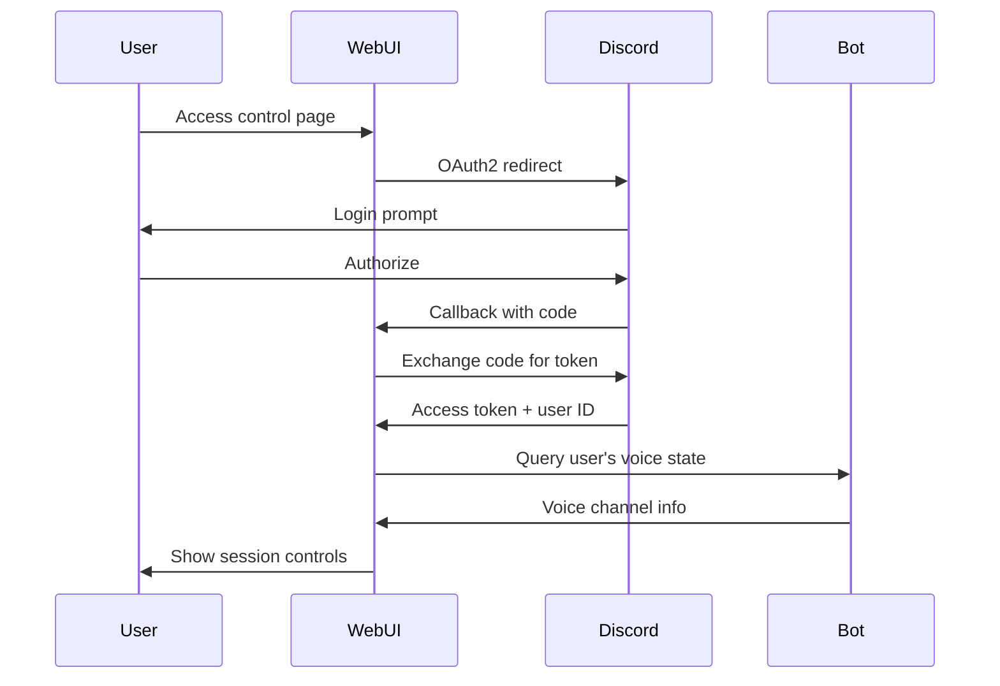

# Discord OAuth Integration (Future Implementation)

> [!NOTE]
> This document outlines the planned Discord OAuth integration for securing the Theatre Bot web UI. **Not yet implemented.**

## Overview

The web UI will use Discord OAuth2 to authenticate users and determine their access permissions based on:

1. Their Discord user ID
2. Which voice channels they're currently connected to
3. Their roles in the servers where the bot is running

## Authentication Flow



## Implementation Requirements

### 1. Discord Application Setup

- Create application at https://discord.com/developers/applications
- Enable OAuth2 with `identify` and `guilds` scopes
- Configure redirect URI for web UI

### 2. User Identification

```typescript
// After OAuth callback, we have the user's Discord UID
const userId = oauthResponse.user.id;
```

### 3. Voice Channel Detection

Use Discord.js to find which voice channel the authenticated user is in:

```typescript
// Check all guilds the bot is in
for (const guild of client.guilds.cache.values()) {
  const member = guild.members.cache.get(userId);
  if (member?.voice.channel) {
    // User is in a voice channel in this guild
    sessions.push({
      guildId: guild.id,
      guildName: guild.name,
      channelId: member.voice.channel.id,
      channelName: member.voice.channel.name,
    });
  }
}
```

### 4. Session Mapping Logic

| Scenario                                 | Behavior                                 |
| ---------------------------------------- | ---------------------------------------- |
| User in 0 voice channels                 | Show error: "Join a voice channel first" |
| User in 1 voice channel                  | Auto-connect to that session             |
| User in multiple channels (multi-device) | Show session picker UI                   |

### 5. Environment Variables

```env
# Discord OAuth (Future)
DISCORD_CLIENT_ID=""
DISCORD_CLIENT_SECRET=""
DISCORD_REDIRECT_URI="http://localhost:8080/auth/callback"
```

## Security Considerations

- Store OAuth tokens securely (httpOnly cookies or server-side sessions)
- Validate user's voice state on every control action (not just initial auth)
- RBAC still applies - OAuth just identifies the user, roles determine permissions
